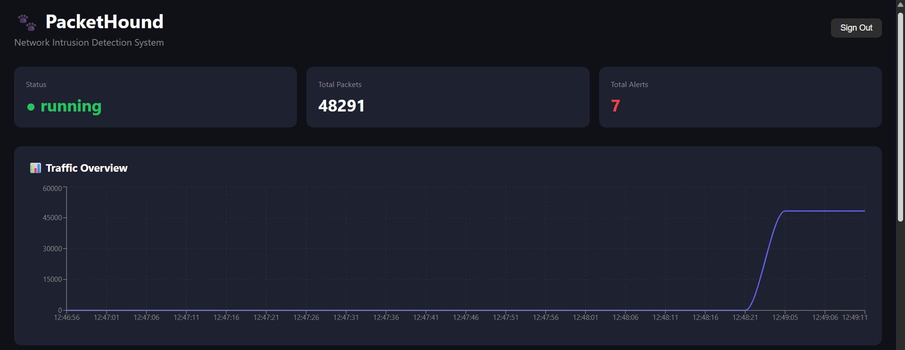
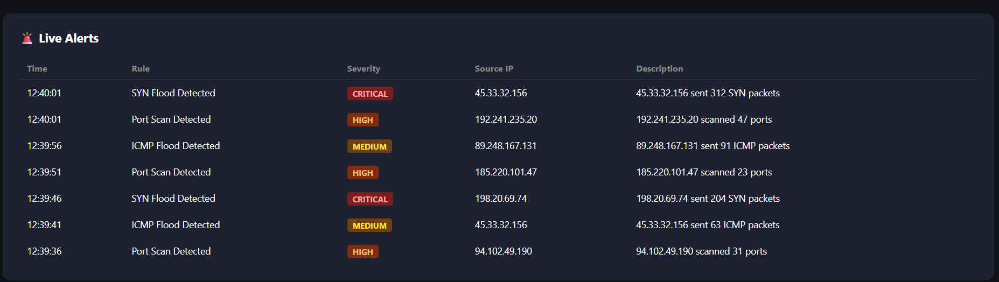
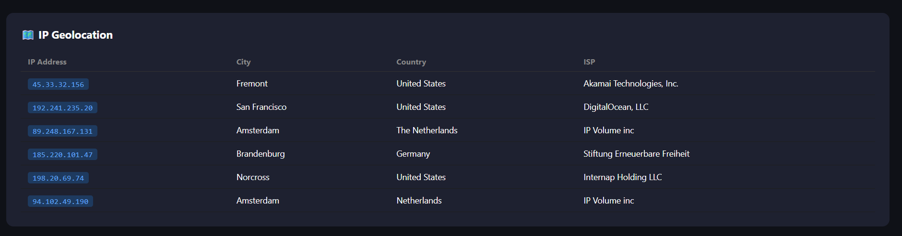
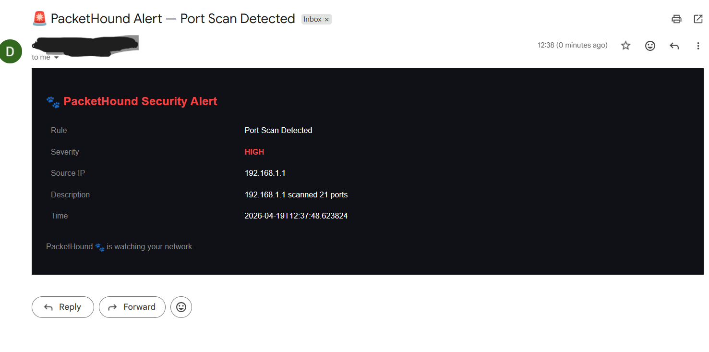

<div align="center">

# 🐾 PacketHound

### Real-Time Network Intrusion Detection System


**PacketHound** sniffs your network in real time, detects intrusion patterns with custom rules, and fires email alerts — all from a slick dark-mode dashboard.



</div>

---

## ✨ Features

- **🔍 Live Packet Capture** — Scapy-powered sniffer captures all IP traffic (TCP, UDP, ICMP) on any interface, buffering up to 1,000 packets per analysis window.
- **🚨 Intrusion Detection Rules** — Three built-in detection engines running every 5 seconds:
  - **Port Scan** — flags any source IP hitting more than 15 unique destination ports (`HIGH`)
  - **SYN Flood** — catches sources sending over 100 SYN packets (`CRITICAL`)
  - **ICMP Flood** — detects ping floods exceeding 50 ICMP packets (`MEDIUM`)
- **📊 Real-Time Traffic Chart** — Live rolling line chart (last 20 data points) showing packet volume over time, updating every 5 seconds.
- **🗺️ IP Geolocation** — Automatically resolves attacker source IPs to city, country, and ISP via the ip-api.com API.
- **📧 Email Alerts** — Async Gmail SMTP notifications triggered instantly for any `CRITICAL` or `HIGH` severity event, with a styled HTML email body.
- **🔌 WebSocket Broadcast** — Detected alerts are pushed to all connected dashboard clients in real time over `/ws/alerts`.
- **🗄️ Persistent Storage** — SQLite database (swappable via `DATABASE_URL` env var) stores every captured packet and generated alert.
- **🔒 Auth-Gated UI** — Simple credential-based login with `localStorage` session persistence.

---

## 📸 Screenshots

### Live Alerts Dashboard

Severity-coded alerts stream in real time — CRITICAL SYN floods, HIGH port scans, and MEDIUM ICMP floods, all with source IP and full descriptions.



---

### Traffic Overview

A live rolling line chart tracks packet volume every 5 seconds. Traffic spikes are immediately visible when an attack begins.


---

### IP Geolocation

Every attacker IP is automatically resolved to city, country, and ISP using the ip-api.com API.



---

### 📧 Email Alerts

PacketHound fires a styled HTML email the moment a `CRITICAL` or `HIGH` alert is detected — no dashboard required.



---

## 🏗️ Architecture

```
PacketHound/
├── backend/
│   ├── main.py              # FastAPI app, lifespan, REST + WebSocket endpoints
│   ├── database.py          # SQLAlchemy engine & session factory
│   ├── models.py            # Packet & Alert ORM models
│   ├── capture/
│   │   └── sniffer.py       # Scapy packet capture → shared ring buffer
│   ├── detection/
│   │   └── rules.py         # Port scan / SYN flood / ICMP flood detectors
│   ├── alerts/
│   │   └── email_alert.py   # Async aiosmtplib Gmail alert mailer
│   └── .env                 # DATABASE_URL, EMAIL_SENDER/PASSWORD/RECEIVER
└── frontend/
    └── src/
        ├── App.js            # Auth router (Login ↔ Dashboard)
        ├── pages/
        │   ├── Login.js      # Credential gate
        │   └── Dashboard.js  # Main view, 5s polling loop
        └── components/
            ├── TrafficChart.js  # Recharts rolling line chart
            └── GeoMap.js        # ip-api.com geolocation table
```

**Data flow:**

```
Network Interface
      │  (Scapy sniff)
      ▼
  Packet Buffer  ──5s──▶  Detection Rules  ──▶  SQLite DB
                                │
                         CRITICAL / HIGH
                                │
                    ┌───────────┴───────────┐
                    ▼                       ▼
             WebSocket Broadcast       Gmail SMTP
                    │
              React Dashboard
         (polls REST every 5s)
```

---

## 🚀 Getting Started

### Prerequisites

- Python 3.10+
- Node.js 18+
- `libpcap` (Linux/macOS) or `Npcap` (Windows) — required by Scapy for raw packet capture
- Root / Administrator privileges for the backend

### 1. Clone the repo

```bash
git clone https://github.com/your-username/PacketHound.git
cd PacketHound
```

### 2. Set up the backend

```bash
cd backend

# Create and activate a virtual environment
python -m venv venv
source venv/bin/activate      # Windows: venv\Scripts\activate

# Install dependencies
pip install fastapi uvicorn[standard] scapy sqlalchemy python-dotenv aiosmtplib

# Configure environment
cp .env.example .env
# Edit .env with your database URL and Gmail credentials
```

**`.env` reference:**

```env
DATABASE_URL=sqlite:///./packethound.db
EMAIL_SENDER=your-email@gmail.com
EMAIL_PASSWORD=your-gmail-app-password
EMAIL_RECEIVER=alerts@yourdomain.com
```

> **Gmail App Password:** Go to [myaccount.google.com/apppasswords](https://myaccount.google.com/apppasswords) and generate a 16-character app password. Do not use your regular Gmail password.

### 3. Start the backend

```bash
# Linux/macOS — packet sniffing requires root
sudo uvicorn main:app --host 127.0.0.1 --port 8001 --reload

# Windows — run terminal as Administrator
uvicorn main:app --host 127.0.0.1 --port 8001 --reload
```

You should see:

```
🐾 PacketHound is running!
[*] PacketHound is sniffing... 🐕
```

### 4. Set up and start the frontend

```bash
cd ../frontend
npm install
npm start
```

The React app will open at `http://localhost:3000`.

### 5. Log in

```
Username: admin
Password: packethound123
```

---

## 🔎 Detection Rules

| Rule | Trigger | Severity | Description |
|---|---|---|---|
| **Port Scan** | Source IP contacts > 15 unique ports in one 5s window | `HIGH` | Identifies horizontal/vertical port scanning behaviour |
| **SYN Flood** | Source IP sends > 100 TCP SYN packets in one 5s window | `CRITICAL` | Detects TCP-layer denial of service attempts |
| **ICMP Flood** | Source IP sends > 50 ICMP packets in one 5s window | `MEDIUM` | Catches ping-based flood attacks |

### Adding a custom rule

Open `backend/detection/rules.py` and follow the same pattern, then register it in `run_all_rules`:

```python
def detect_udp_flood(buffer: list) -> list:
    alerts = []
    udp_map = defaultdict(int)
    for p in buffer:
        if p["protocol"] == 17:  # UDP
            udp_map[p["src_ip"]] += 1
    for ip, count in udp_map.items():
        if count > 200:
            alerts.append({
                "timestamp": datetime.now().isoformat(),
                "src_ip": ip,
                "dst_ip": "multiple",
                "rule_name": "UDP Flood Detected",
                "severity": "HIGH",
                "description": f"{ip} sent {count} UDP packets"
            })
    return alerts

def run_all_rules(buffer: list) -> list:
    alerts = []
    alerts.extend(detect_port_scan(buffer))
    alerts.extend(detect_syn_flood(buffer))
    alerts.extend(detect_icmp_flood(buffer))
    alerts.extend(detect_udp_flood(buffer))   # ← register here
    return alerts
```

---

## 🔌 API Reference

| Method | Endpoint | Description |
|---|---|---|
| `GET` | `/` | Health check — returns `{"message": "PacketHound 🐾 is live!"}` |
| `GET` | `/api/stats` | Returns `total_packets`, `total_alerts`, and `status` |
| `GET` | `/api/alerts?limit=50` | Returns the latest N alerts ordered by timestamp descending |
| `GET` | `/api/packets?limit=100` | Returns the latest N captured packets |
| `WS` | `/ws/alerts` | WebSocket — streams new alert JSON objects to connected clients |

---

## ⚙️ Configuration

| Variable | Default | Description |
|---|---|---|
| `DATABASE_URL` | `sqlite:///./packethound.db` | SQLAlchemy database connection string |
| `EMAIL_SENDER` | — | Gmail address to send alerts from |
| `EMAIL_PASSWORD` | — | Gmail app password (not your account password) |
| `EMAIL_RECEIVER` | — | Address to receive alert emails |

To capture on a specific interface, edit `main.py`:

```python
thread = threading.Thread(
    target=start_sniffing,
    kwargs={"interface": "eth0"},   # e.g. "eth0", "en0", "Wi-Fi"
    daemon=True
)
```

---

## 🛣️ Roadmap

- [ ] Configurable detection thresholds via UI
- [ ] Interactive world map for IP geolocation (Leaflet)
- [ ] Per-rule alert suppression / cooldown period
- [ ] Export alerts to CSV / JSON
- [ ] Docker Compose setup for one-command deployment
- [ ] Webhook support (Slack, Discord, PagerDuty)
- [ ] Dark/light theme toggle

---

## 🤝 Contributing

1. Fork the repository
2. Create a feature branch: `git checkout -b feature/your-feature-name`
3. Commit your changes: `git commit -m "feat: add your feature"`
4. Push to the branch: `git push origin feature/your-feature-name`
5. Open a Pull Request

---

## ⚠️ Security Notice

This project is intended for **educational and authorized network monitoring use only**. Raw packet capture requires elevated privileges. Always ensure you have explicit permission to monitor any network you run PacketHound on. Do not commit your `.env` file or expose your Gmail app password publicly.

---

## 📄 License

Distributed under the MIT License. See `LICENSE` for details.

---

<div align="center">

Made with 🐾 and Python

*PacketHound is watching your network.*

</div>
